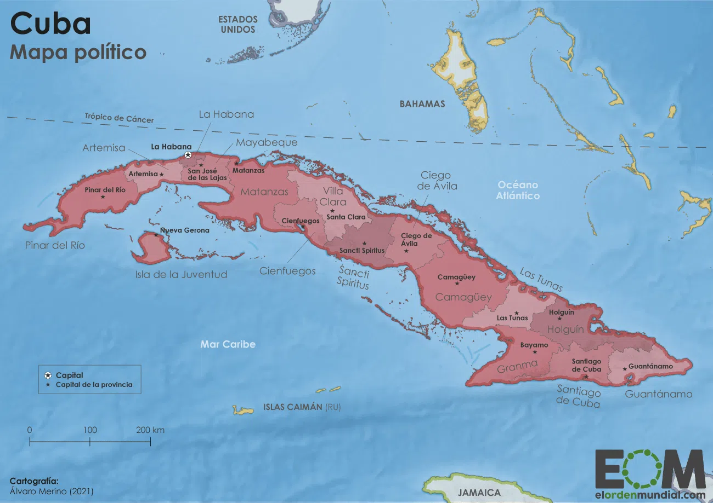

# I.I. Génesis

- Most cubanos descend from:
  1. **españoles**: andaluces, canarios;
  2. **africanos**: yoruba, bantú.
- Small Cuban populations descend from:
  1. other **Caribbeans**;
  2. **French**;
  3. **Chinese**.

## 1. Amerindios

- **Arawak** = **taíno** — the most economically and socially developed Amerindians in Cuba.

 

- **Areíto** = **areyto** — 
  1. the main social event of Cuba, Quisqueya, Borinquen;
     - music, poetry, dance;
     - instruments:
       - mayohuacán;
       - güiro;
       - maracas;
       - (sometimes) flutes;
       - (sometimes) seashell trumpets;
      - varied depending on region and social occasion;
      - could last for days;
      - tequina (vocal / dance leader) + chorus of ~300 men and women, singing responsorially: the chorus repeated the tequina’s every line at a lower / higher pitch, while the tequina kept dancing in silence; the soloist could change; the narrative song could last uninterruptedly from one day to the next;
      - occasions:
        - making a petition (for e.g., crop fertility, protection from hurricanes);
        - rendering homage (e.g., Princess Anacaona’s areíto for the Hispaniola governor);
        - celebrating an important wedding / war victory;
        - solemnizing a funerary memorial;
        fostering recreation;
     - text: commemorating the past, the ancestors and their deeds, sometimes mentioning how each had died;
  2. (later) a religious celebration of music, dance, theater; dancers played maracas and may have worn rattles tied to their ankles.

- Voices:
  - elderly — low;
  - young — upper;
  - women — tenór, alto, soprano.

- Taíno singing was not harsh to European ears.
- It is unknown what taíno music sounded like, but historians have recorded some instruments. Apparently, there is no Amerindian influence in la música cubana.

- Taínos and Africans lived together as cimarrones. → Africans might have absorbed taíno musical elements:
  - drums, other instruments;
  - antiphonal singing;
  - ecstatic mass singing and dancing.
