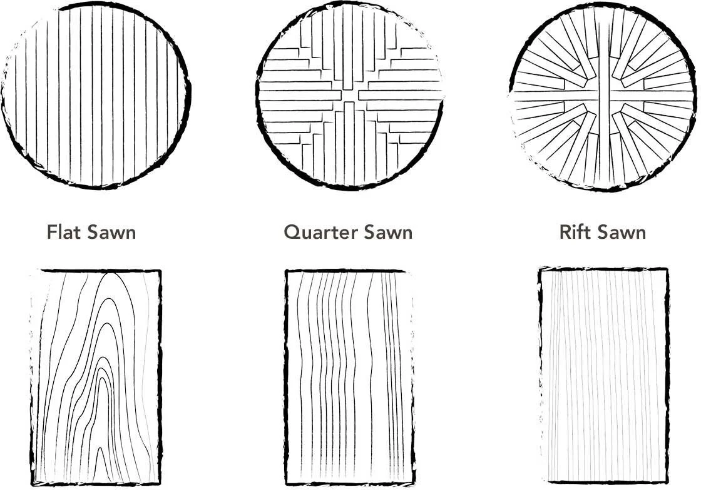

# Characteristics
## Grain

- **Wood grain** = **tree rings**.[^Kert]

<!-- Footnotes [ -->
[^Kert]: [**Kert M.**](https://youtu.be/R8R2DXlqVgU?si=OiApUudeAoMCixtA)
<!-- ] Footnotes -->

- Rings alternate between:
  - light, wide — grown at spring (trees grow faster);
  - dark, narrow, dense — grown in autumn (trees grow slower).

### Strength[^Workshop]

<!-- Footnotes [ -->
[^Workshop]: [**Workshop Companion**](https://youtu.be/oZkYLVrTYe4?si=m93uFLkxhwl8m-dD)
<!-- ] Footnotes -->

- Wood consists of long cellulose fibers bound together by a glue-like lignin. Splitting cellulose is harder than lignin. → Wood is stronger along the grain.

 

- All strength measurements are averages.

#### Specific Gravity

- **Specific gravity** = **density** calculated by comparing the same volume of wood and water. Water’s specific gravity is 1.0. A specific gravity <1.0 means that the wood floats.
- Important for, e.g., boats.

1. Poplar — 0.42.
2. Cherry — 0.50.
3. Walnut — 0.55.
4. Yellow pine — 0.59.
5. Hard maple — 0.63.
6. White oak — 0.68.
7. Ebony — 1.0. → Sinks.

#### Compressive Strength

- **Compressive strength** — resistance to pressure applied along the grain.
- Important for, e.g., table legs.

1. Poplar — 5540 psi.
2. Cherry — 7110 psi.
3. White oak — 7440 psi.
4. Walnut — 7580 psi.
5. Hard maple — 7830 psi.
6. Yellow pine — 8470 psi.

#### Bending Strength

- **Bending strength** = **modulus of rupture** — resistance to pressure applied perpendicular to the grain.
- Important for, e.g., table tops, canoe paddles.

1. Poplar — 10 100 psi.
2. Cherry — 12 300 psi.
3. Yellow pine — 14 500 psi.
4. Walnut — 14 600 psi.
5. White oak — 15 200 psi.
6. Hard maple — 15 800 psi.

#### Stiffness

- **Stiffness** = **modulus of elasticity** — resistance to bowing.
- Important for, e.g., shelves, archery bow, fishing pole.

1. Cherry — 1.49 Mpsi.
2. Poplar — 1.58 Mpsi.
3. Walnut — 1.68 Mpsi.
4. White oak — 1.78 Mpsi.
5. Hard maple — 1.83 Mpsi.
6. Yellow pine — 1.98 Mpsi.

#### Hardness

- **Hardness** — resistance to abuse.
- Important for, e.g., desktop, workbench top, baseball bat.

1. Poplar — 540 lbs.
2. Yellow pine — 870 lbs.
3. Cherry — 950 lbs.
4. Walnut — 1010 lbs.
5. White oak — 1360 lbs.
6. Hard maple — 1450 lbs.

## Moisture[^Workshop]

- 