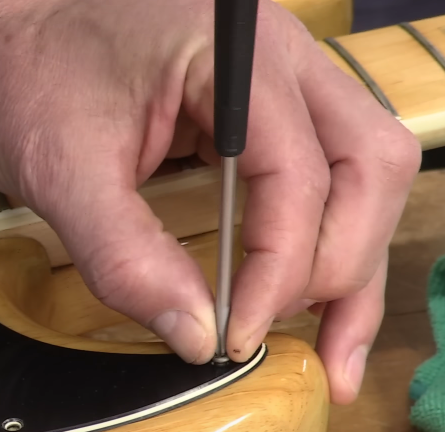

# Parts

# Tips

- Before putting a screw into an instrument, always wax it — for it not to break.[^https://youtu.be/MOhKg_noW3Y?si=k4QUIuVr0VYDiYB8]
- When rotating a screw, keep the fingers around the screwdriver’s tip — to not hit the finish if the screwdriver slips.[^https://youtu.be/NEeVvOruG5o?si=dqVRRdI7GgqjevOl]

- After putting a screw in the nut, rotate it to the left until you find the threads — to not strip the threads.[^https://youtu.be/NEeVvOruG5o?si=dqVRRdI7GgqjevOl]

<!-- Footnotes -->
[^https://youtu.be/MOhKg_noW3Y?si=k4QUIuVr0VYDiYB8]: [**StewMac**](https://youtu.be/MOhKg_noW3Y?si=k4QUIuVr0VYDiYB8) (Gluck E.)

[^https://youtu.be/NEeVvOruG5o?si=dqVRRdI7GgqjevOl]: [**StewMac**](https://youtu.be/NEeVvOruG5o?si=dqVRRdI7GgqjevOl) (Inbody G.)