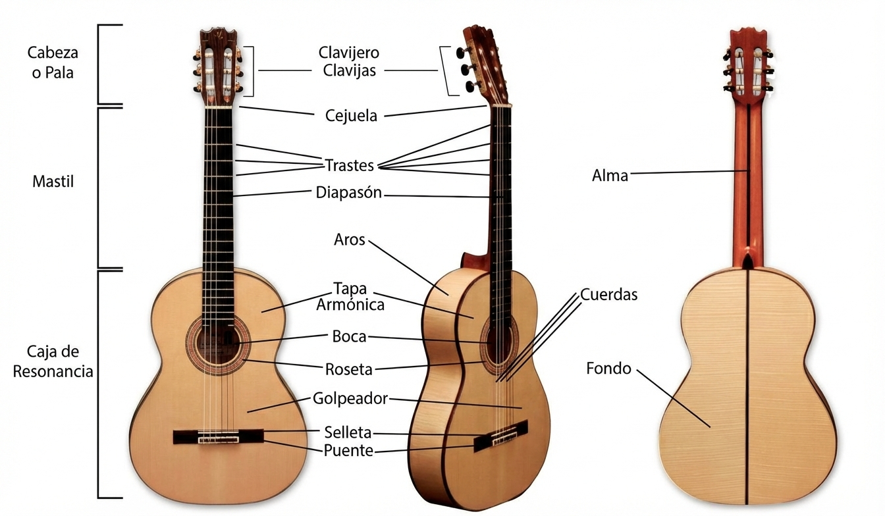

- The only straight line in a good guitar is a string at rest.[^https://youtu.be/6mWcPNPPW4k?si=oxvBTptjIf9LbKY4]

# Solid vs. Laminated
## Solid
- The most sophisticated, nuanced sound.
- Improves with age (at least sides and back).[^https://www.taylorguitars.com/guitars/acoustic/features/woods/body-woods]
- The quality varies greatly.
- Expensive guitars.

## Laminated
- **Laminated** — fused layers of cheaper wood with a decent wood veneer.

 

1. Deteriorates with time.
2. Cheap guitars.

## ***
- Good compromise: solid top + laminated sides and back.

# I.I. Plates

- [^https://youtu.be/tWKU0nM2LPE?si=dlqtNrHxe0yvUARW]
A single-piece plate requires an exceptionally thick tree, which would be:
  - old, → have lots of stresses, cracks; grain lines looking awkward;
  - rare;
  - expensive to ship;
  - untraditional.

 

- The top, sides, and back woods must work well together.
- Common: softwood top + hardwood back.

## I.I.I. Top

- **Top plate** = **soundboard**.
- The biggest influence on the sound.

 

- Guitars require a wood that is both:
  1. strong along the grain;
  2. weak across it.
- → Spruce, cedar are traditional choices, but other woods can be used too (e.g., maple unless it has too many flames).

 

- Both spruce and cedar tops last for centuries.[^https://youtu.be/uHQ0KM6KwTw?si=QUUjTAA9xh-PDI0X]

### Thickness[^https://youtu.be/6mWcPNPPW4k?si=VL9eG7dNEvfRUahd]

- A luthier has to determine the right thickness for each piece of wood based on his feeling through his fingers.[^https://youtu.be/SWYSKRQEh0c?si=xy-uUlM9tJ3F7z1q]

- Thinner top $\Rightarrow$ 
  - muddier lows;
  - stronger vibration.

#### Uniformity

- Hauser-, Fleta-style guitars: M. E. Bruné generally makes the top of varying thickness.
- To see the thicknesses of different areas: put the top and cardboard around it (for eye protection) onto a light table (— essentially an LED ceiling light upside down with a piece of smoked glass).
  - Only works for spruce.

#### Measurements

- Depends on the flexibility of the particular top. 
- Every piece of wood is different in its flexibility and sound. 
- Assess the flexibility: flex the top with and across the grain.

 

- Building to predetermined numbers is fine. When copying a guitar, the measurements make the copy ~ 85% alike with the original. But “the magic” happens in the rest ~ 15% — which is the ability to feel the wood flexibility.

 

- Thickness varies: 1.4 mm (some Torres guitars) – 3.5 mm (some Hauser guitars).
- Modern standards:
  - 1.6–1.8 mm — thin;
  - 2.2–2.3 mm — thick.

### * * *

- The “bellying” behind the bridge is normal.[^https://youtu.be/6mWcPNPPW4k?si=oxvBTptjIf9LbKY4]

## I.I.II. Back, Sides

- Sides and back are generally made from the same wood.
- The wood is chosen for its ability to eliminate / amplify the frequencies produced by the top. $\Rightarrow$ Greatly influence the sound.

### I.I.II.I. Back

- The back is arched because:
  1. acts as a parabolic reflector directing the sound; → sounds better;
  2. when it dries up, it has more room to shrink in.

 

- A correctly-built guitar taps out at ~ F# / G, due to the physics of its body size.[^https://youtu.be/L6UlQ-ZOEHE?si=k1DJAfGV5C5ryIwl]

#### Making[^https://youtu.be/L6UlQ-ZOEHE?si=7I95WDcINQ5-NLGQ]

1. Pick the wood species.
2. Cut out a general back plate shape.
3. The most even side will be the outer one.
4. Draw a centerline.
5. Roughly line up the form to the centerline and trace it.

 

- M. E. Bruné glues the back plate parts with CA.[^https://youtu.be/31TzgrRotyQ?si=STV_AtX6l8z_LmPk]
- Check for checkmarks: before sanding down, apply CA on both sides of the plate every ~ 2” to see how far it runs inside the checks.[^https://youtu.be/31TzgrRotyQ?si=STV_AtX6l8z_LmPk]

 

- Thickness (Brazilian rosewood): 2.5–2.6 mm.[^https://youtu.be/31TzgrRotyQ?si=STV_AtX6l8z_LmPk]

### I.I.II.II. Sides

- 

<!-- Footnotes -->
[^https://youtu.be/L6UlQ-ZOEHE?si=7I95WDcINQ5-NLGQ]: [**Bruné M. E.**](https://youtu.be/L6UlQ-ZOEHE?si=7I95WDcINQ5-NLGQ)

[^https://youtu.be/L6UlQ-ZOEHE?si=k1DJAfGV5C5ryIwl]: [**Bruné M. E.**](https://youtu.be/L6UlQ-ZOEHE?si=k1DJAfGV5C5ryIwl)

[^https://youtu.be/6mWcPNPPW4k?si=oxvBTptjIf9LbKY4]: [**Bruné M. E.**](https://youtu.be/6mWcPNPPW4k?si=oxvBTptjIf9LbKY4)

[^https://youtu.be/6mWcPNPPW4k?si=VL9eG7dNEvfRUahd]: [**Bruné M. E.**](https://youtu.be/6mWcPNPPW4k?si=VL9eG7dNEvfRUahd)

[^https://youtu.be/uHQ0KM6KwTw?si=QUUjTAA9xh-PDI0X]: [**Bruné M. E.**](https://youtu.be/uHQ0KM6KwTw?si=QUUjTAA9xh-PDI0X)

[^https://youtu.be/SWYSKRQEh0c?si=xy-uUlM9tJ3F7z1q]: [**Bruné M. E.**](https://youtu.be/SWYSKRQEh0c?si=xy-uUlM9tJ3F7z1q)

[^https://www.taylorguitars.com/guitars/acoustic/features/woods/body-woods]: [**Taylor Guitars**](https://www.taylorguitars.com/guitars/acoustic/features/woods/body-woods)

[^https://youtu.be/6mWcPNPPW4k?si=oxvBTptjIf9LbKY4]: [**Bruné M. E.**](https://youtu.be/6mWcPNPPW4k?si=oxvBTptjIf9LbKY4)

[^https://youtu.be/31TzgrRotyQ?si=STV_AtX6l8z_LmPk]: [**Bruné M. E.**](https://youtu.be/31TzgrRotyQ?si=STV_AtX6l8z_LmPk)

[^https://youtu.be/tWKU0nM2LPE?si=dlqtNrHxe0yvUARW]: [**Bruné M. E.**](https://youtu.be/tWKU0nM2LPE?si=dlqtNrHxe0yvUARW)

[^https://youtu.be/fpfyF4gx3jw?si=_G84UBCpwE-u2nhO]: [**Bloomberg** (flamenco)](https://youtu.be/fpfyF4gx3jw?si=_G84UBCpwE-u2nhO)