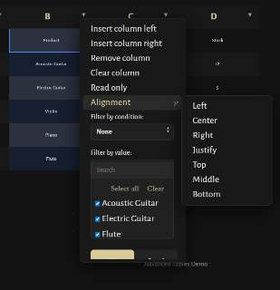
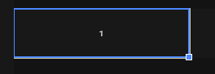

---

---

---

1. increase the font size for spreadsheet cells.

2. replace the down arrows with chevrons like in the left side bar. align them middle relative to the cell names (A, B, etc.)

3. menus, submenus: 
- remove the small arrow next to "alignment"
- decrease the left and right margins for text
- make all menus' length and width fit the content (not more, not less)
- animate the menu the same way as the left side bar menu is animated (expansion / collapse)
- make the filter by value section: 
1) bigger, 
2) possible multiple-columned (if the values fit), 
3) scrollable (but not with the default browser scrollbar; you may use the commented out scrollbar style that i have in some of the .scss)
4) some text is still serif. fix it
5) checkboxes with website theme colors

4. filter by value section: replace the up and down arrows with the same chevrons as above, and make them on the same level as text

5. make the selected cell highlight of some fitting website color, not default blue.

6. remove those white borders that appear on cell selection (see photo 2)

---

1. in "_colors.scss" I've added some of the variables for the folders (commented out). Assign colors to each. You may add more subcategories.
2. For subcategories, use lighter shades of the parent category's color.
3. Then make the folders / categories across the entire website (in the left sidebar, in the graph, in the reading tracker, tabs, etc.) appear with their corresponding colors.

---

- make the tabbed layout flexible: make it scale tabs depending on their amount, and keep the tabs rows centered
- give me an ability to deliberately put certain tabs in certain rows

---

- create the following layout and put it on page "content\Notas\I. Ciencia\7. Música\7.2. Laudería\7.2.2. Cordófonos\Guitarra\La guitarra\III. Instruments":
  - 3 big SVGs of classical (preferably some Torres model), acoustic (preferably some classic Martin model), and electric (preferably Les Paul or Telecaster) guitars in a row.
  - under each SVG, the name of the .md files (III.I. Clásica, III.II. Acoustic, III.III. Electric)
  - each SVG (along with its text) is a link to the corresponding .md file

---

- nested numbered lists under unnumbered lists appear as a continuation of some previous numbered lists. Fix it. 

---

- how to get better tables in .md? more controllable and customizable, like in Excel / Google Sheets, or at least like in Word / Google Docs. Particularly, I need to be able to merge cells.

---

- when centering headings, is it possible to ignore the footnotes (superscript)?

---

- move the breadcrumbs to the very top of the page
- style the breadcrumbs expansion menu similar to the VS Code breadcrumbs (see screenshot). remove their chevrons. make them expand on click, and on second click open the corresponding page 

---

- make the .md page items foldable like in the Obsidian (see the screenshot) and the VS Code editor

---

- Prevent the text labels on the globe from overlapping, while placing each one in its most appropriate location on the globe.

- Exclude French Guiana from the Mediterráneo region.

---

- Page "Laudería":
  - row 1 — Woodworking symbol, row 2 — piano, violin, guitar symbols, row 3 — aerófonos symbol.

---

- Style the graph like in the lastest version of Obsidian.

- Can you add a menu interface controlling the graph on the Home page, like the Obsidian has (see the screenshot)? 

---

- make a visual library (bookshelf) with book covers (similar to what people do in Obsidian). transform this page into such library: "content\Notas\I. Ciencia\7. Música\7.2. Laudería\7.2.2. Cordófonos\Guitarra\Libros (sumarios)"

- Create a new page in the folder "II. Personal". Make it a reading tracker similar to what I have on Google Sheets (see the screenshot):
1. books sorted by categories and subcategories (that mirror my "I. Ciencia" folder and subfolders) 
2. columns: 
   1. Ciencia (area)
   2. Subarea
   3. Author
   4. Title
   5. Chapter
   6. Year
   7. Timing (dates):
      1. start
      2. end
   8. pages:
      1. current (make it editable, so I could easily update it)
      2. total
      3. Progress bar + percentage text overlayed on top of the bar
3. give me an ability to color categories (I'll do that later)
4. total read books (overall and per category).
5. copy this book list: "D:\Downloads\Tareas.xlsx"

---

- make images on the website clickable to expand to full screen

---

- copy the globe to the page "4. Historia", but adapt its countries / links to the folders and files inside the "4. Historia" folder.
- instead of the modern post-Soviet countries, make the USSR appear on the globe

---

- This repository got too complex. Optimize it carefully, making sure that nothing breaks. Make it easier to edit and control the website manually.
    - remove reduntant and unused files (e.g., everything related to the light theme, because I only want the current dark theme, etc.), folders. (don't edit the "content/Notas" folder)

    - is it possible to merge certain files, so that editing and controlling various elements of the website would be from a single place? E.g., 
      - the graph appearance (font, colors, background,etc.) is controlled from one file, 
      - the globe layout (positions, etc.) is controlled from another file, 
      - the Markdown rendering (colors, etc.) is controlled from another file, 
      - etc.

    - go through all files (especially .scss), and optimize and clean them up: delete reduntant code, order the code blocks logically, group lines visually where possible, etc.

    - remove unnecessary comments, like commented-out code blocks.

    - add clear, concise comments to the .scss files in the "assets" folder, also add comments describing what each file does.

---

- How to color the folders in the left side bar and in the reading tracker according to their color in the graph? So that I could control the colors from a single place.

---

- Is it possible to add at least a simple text editor to the pages that are rendered from .md files?
- How to create a "Live Preview" mode (like the Obsidian has) for .md inside VS Code or the website?

---

- shortcuts in the bottom bar of VS Code
  - "Serve": 
    - if the website is already running, make it stop, and then serve again
  - add a shortcut that resets the repository to the last commit (git reset --hard HEAD). make a confirmation warning appear before performing the task.