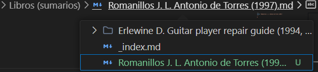
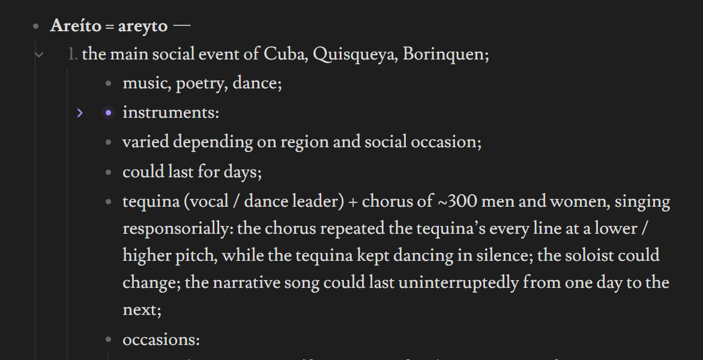
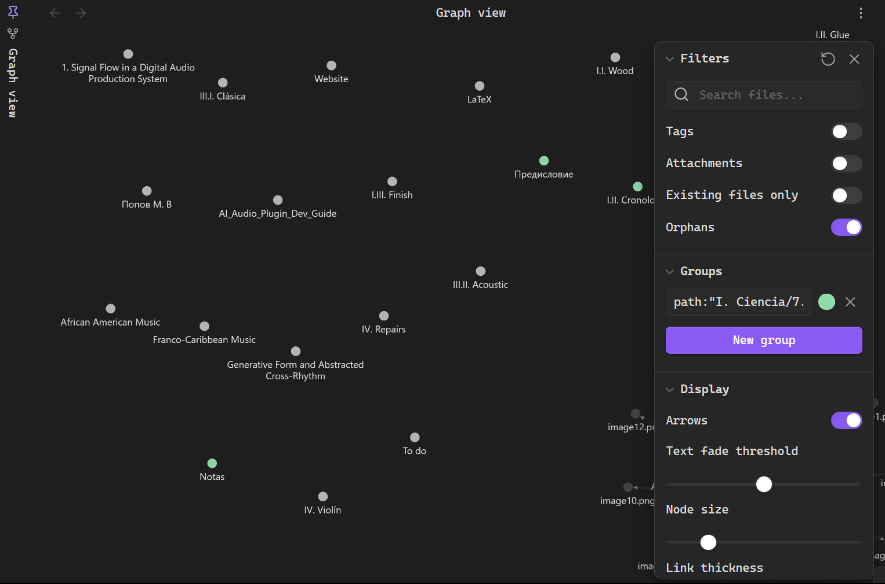
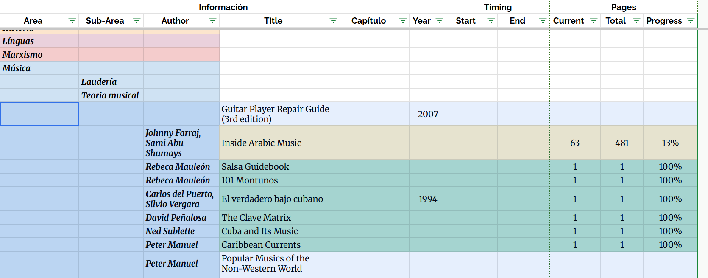

---

---

- The "Pin" icon:
  - replace the icon with a vertical single bar (ensure it looks professional and modern),
  - make bigger

- I have breadcrumbs on certain pages (when enabled). make the breadcrumbs expandable on click like they are inside VS Code (see screenshot), so that they expanded manu shows other items in their folder 

---

- make the .md page items foldable like in the Obsidian (see the screenshot) and the VS Code editor

---

- Prevent the text labels on the globe from overlapping, while placing each one in its most appropriate location on the globe.

- Exclude French Guiana from the Mediterráneo region.

---

- Page "Laudería":
  - row 1 — Woodworking symbol, row 2 — piano, violin, guitar symbols, row 3 — aerófonos symbol.

---

- Style the graph like in the lastest version of Obsidian.

- Can you add a menu interface controlling the graph on the Home page, like the Obsidian has (see the screenshot)? 

---

- make a visual library (bookshelf) with book covers (similar to what people do in Obsidian). transform this page into such library: 
  - /Notas/I.-Ciencia/7.-Música/7.2.-Laudería/7.2.2.-Cordófonos/Guitarra/Libros-sumarios

- Create a new page in the folder "II. Personal". Make it a reading tracker similar to what I have on Google Sheets (see the screenshot):
1. books sorted by categories and subcategories (that mirror my "I. Ciencia" folder and subfolders) 
2. columns: 
   1. Ciencia (area)
   2. Subarea
   3. Author
   4. Title
   5. Chapter
   6. Year
   7. Timing (dates):
      1. start
      2. end
   8. pages:
      1. current (make it editable, so I could easily update it)
      2. total
      3. Progress bar + percentage text overlayed on top of the bar
3. color each category according to its color in the graph.
4. total read books (overall and per category).
5. copy this book list: "D:\Downloads\Tareas.xlsx"

---

- make images on the website clickable to expand to full screen

---

- copy the globe to the page "4. Historia", but adapt its countries / links to the folders and files inside the "4. Historia" folder.
- instead of the modern post-Soviet countries, make the USSR appear on the globe

---

- This repository got too complex. Optimize it carefully, making sure that nothing breaks. Make it easier to edit and control the website manually.

    - remove reduntant and unused files (e.g., everything related to the light theme, because I only want the current dark theme, etc.), folders. (don't edit the "content/Notas" folder)

    - is it possible to merge certain files, so that editing and controlling various elements of the website would be from a single place? E.g., 
      - the graph appearance (font, colors, background,etc.) is controlled from one file, 
      - the globe layout (positions, etc.) is controlled from another file, 
      - the Markdown rendering (colors, etc.) is controlled from another file, 
      - etc.

    - go through all files (especially .scss), and optimize and clean them up: delete reduntant code, order the code blocks logically, group lines visually where possible, etc.

    - remove unnecessary comments, like commented-out code blocks.

    - add clear, concise comments to the .scss files in the "assets" folder, also add comments describing what each file does.

---

- How to color the folders in the left side bar and in the reading tracker according to their color in the graph? So that I could control the colors from a single place.

---

- Is it possible to add at least a simple text editor to the pages that are rendered from .md files?
- How to create a "Live Preview" mode (like the Obsidian has) for .md inside VS Code or the website?

---

- shortcuts in the bottom bar of VS Code
  - "Serve": 
    - if the website is already running, make it stop, and then serve again
  - add a shortcut that resets the repository to the last commit (git reset --hard HEAD). make a confirmation warning appear before performing the task.